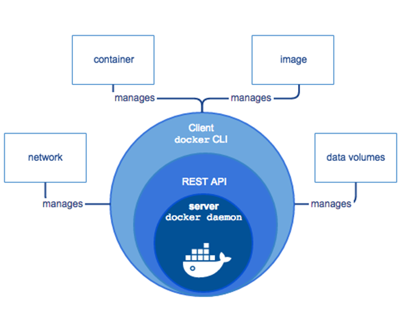

# Docker


## Quickstart

### 卸载

* 使用命令查找 需要卸载应用 `docker version`  找到

  > Package version: docker-1.13.1-75.git8633870.el7.centos.x86_64

* 使用`yum`移除 `yum -y remove docker-1.13.1-75.git8633870.el7.centos.x86_64`

* 彻底清除 `rm -rf /var/lib/docker/`

  >```shell
  >yum remove docker \
  >                  docker-client \
  >                  docker-client-latest \
  >                  docker-common \
  >                  docker-latest \
  >                  docker-latest-logrotate \
  >                  docker-logrotate \
  >                  docker-selinux \
  >                  docker-engine-selinux \
  >                  docker-engine
  >```
  >
  >find / -name docker


### 安装

1. >
   >```sh
   >yum install -y yum-utils \
   >  device-mapper-persistent-data \
   >  lvm2
   >```

2. >
   >```shell
   >yum-config-manager \
   >    --add-repo \
   >    https://download.docker.com/linux/centos/docker-ce.repo
   >```

3. >
   >```shell
   >yum install docker-ce
   >```

4. >```shell
   >systemctl start docker
   >```

5. > 如果不行则重启  
   > docker version

* 获取地址 `www.docker.com`, `www.docker-cn.com` ，`hub.docker.com`

### Docker 的组成

* 容器
* 镜像
* 仓库

### 基本命令

* 查看本地所有镜像 `docker image`

  * `-a` 列出所有的镜像

  * `-q` 只显示镜像ID

  * `--digests` 只显示摘要信息

  * `--no-trunc`
* 查看详细信息 `docker info`
* 帮助命令 `docker --help`
* 查找远程镜像 `docker search tomcat/centos/nginx` 

  * 查找STARS大于30的TOMCAT`docker search -s 30 tomcat`
* 拉取远程镜像到本地 `docker pull tomcat/centos/nginx`
* 删除镜像 `docker rmi `+ 镜像 ID

  * 删除单个 `docker rmi -f` 镜像名
  * 删除多个 `docker rmi`镜像名1:TAG1 镜像名2
  * 删除全部 `docker rmi -f $(docker images -q)`
* 新建容器并启动 `docker run [options] IMAGE [command] [ARG] `+ 镜像名

  * OPTIONS 
    * `--name`  为容器指定别名
    * `-d` 后台运行容器
    * `-i` 交换方式运行
    * `-t` 启动一个伪终端
    * `-p` 指定端口映射
    * `-P` 随机端口映射
  * 示例 
    * `docker run -it ef802ca71927` 启动容器
    * `docker run -it -p8888:8080 ef802ca71927` 指定端口号
    * `docker run -i -t -d --name tomcat1 ef802ca71927` 后台启动 且指定别名
    * `docker run -d -p 9999:8080 --name tomcat-run2 tomcat`
* 列出所有运行的容器 `docker ps [options]`

  * OPTIONS
    * `-a` 列出所有政治运行的容器+历史运行过的
    * `-l` 显示最近创建的容器
    * `-n` 显示最近 N个创建容器
    * `-q` 只显示容器ID
  * 示例
    * `docker ps -n 1` 显示1个容器
* 退出容器

  *  `exit` 退出并停止容器

  * `ctrl + p+ q` 退出不停止容器
* 启动容器 `docker start `容器ID 或者 容器名称
* 重启容器 `docker restart` 容器ID 或者 容器名称
* 停止容器 `docker stop` 容器ID 或者 容器名称
* 删除容器 `docker rm` 容器ID 或者 容器名称
* 强制停止容器 `docker kill` 容器ID 或者 容器名称
* 删除多个容器 

  * `docker rm -f $(docker ps -a -q)`
  * `docker ps -a -q|xargs docker rm`
* 后台启动 `docker run -d` 镜像ID或者镜像名称
* 查看日志 `docker logs -f -t --tail `容器ID
* 查看容器内进程 `docker top` 容器ID
* 查看容器详细信息 `docker inspect` 容器ID
* 进入正在运行的容器 并且前台方式运行

  * `docker exec -it `容器ID bashshell 产生新进程
    * `docker exec -it 89ec5f991a31 /bin/bash`
  * `docker attach`容器ID  进入容器，不产生新的进程
* 从容器内拷贝文件到主机
  * `docker cp ` 容器ID : 容器内路径 主机路径
    * `docker cp 89ec5f991a31:/usr/local/tomcat/webapps/ROOT/index.jsp /usr/`

* 提交容器

  * `docker commit -m='NAME' -a='作者'`容器ID 目标镜像名称:TAG

* 容器内安装 `vim`

  > apt-get update
  >
  > apt-get install vim

* `mysql` 使用示例

  操作命令行在 `/usr/local/mysql`

  ```shell
  docker run -p 3309:3306 -v $PWD/conf:/etc/mysql/conf.d -v $PWD/logs:/logs -v $PWD/data:/var/lib/mysql -e MYSQL_ROOT_PASSWORD=123456 -d mysql
  ```


## Docker 数据卷

**数据卷就是容器在宿主机挂载的目录磁盘**

### 基本命令

* 简单挂载

  ```shell
  docker run -it -v /usr/workspace/docker/data:/datacontainer centos
  ```

  把 宿主机 的`/usr/workspace/docker/data` 目录挂载在 容器 `centos` 的`/datacontainer` 目录

* 数据容器卷

  ```shell
  docker run -it --name n0 -v /usr/workspace/docker/data:/datacontainer centos
  ```

  ```shell
  docker run -it --name n1 --volumes-from n0 centos
  ```

  `n1` 容器 共享 `n0`容器卷

## Dockerfile

### 关键字

* `FROM` 基础镜像，当前新镜像是基于哪个镜像的

* `MAINTAINER` 进行的维护者的姓名和邮箱

* `RUN` 镜像构建时需要运行的命令

* `WORKDIR` 容器创建后 , 默认在哪个目录

* `EXPOSE ` 当前容器对外暴露的端口

* `ENV` 用来在构建镜像时设置的环境变量

* `ADD` 将宿主机的目录下的文件拷贝到镜像且`ADD` 命令会自动解压压缩包`tar.gz`

* `COPY` 

* `VOLUME` 容器数据卷，勇仔保存和持久化

* `CMD` 指定容器的启动过程中需要运行的命令

  坑：多条CMD命令，只有一条生效，CMD命令会被`doker run` 之后的参数替换

* `ENTRYPOINT` 指定容器启动过程中需要运行的命令

  ENTRYPOINT会把`docker run` 命令的参数追加到后面

* `ONBUILD`


## Docker 网络

[参考资料](https://www.cnblogs.com/whych/p/9595671.html)

* 查看网络设备 `docker network ls`
* 进入 `docker network inspect id`
* 创建网络设备`docker network create -d bridge test-bridge`
* 运行时选取网络设备 `docker run -d -name network-test --network test-bridge bushbox /bin/sh -c "while true; do sleep 36000; doone"`
* 把一个容器指定到一个网卡中 `docker network connect test-bridge cId`

### 示例

[参考资料](https://hub.docker.com/search/?q=tomcat&type=image)

[tomcatDockerfile示例] (https://github.com/docker-library/tomcat/blob/4b7edb6276a275185ddeb3db989573bf35aca2b5/8.5/jre8/Dockerfile)

* 简单`Dockerfile`

  ```dockerfile
  FROM centos
  MAINTAINER zsjdxc251<zsjdxc251@live.com>
  COPY test.txt /usr/local/testincontainer.txt
  ADD apache-tomcat-9.0.14.tar.gz /usr/local/
  ADD jdk-8u191-linux-x64.tar.gz /usr/local
  #RUN yum -y install vim
  
  ENV MYPATH /usr/local
  WORKDIR $MYPATH
  ENV JAVA_HOME /usr/local/jdk1.8.0_191
  ENV CLASSPATH $JAVA_HOME/lib/dt.jar:$JAVA_HOME/lib/tools.jar
  ENV CATALINA_HOME /usr/local/apache-tomcat-9.0.14
  ENV CATALINA_BASE /usr/local/apache-tomcat-9.0.14
  ENV PATH $PATH:$JAVA_HOME/bin:$CATALINA_HOME/lib:$CATALINA_HOME/bin
  
  EXPOSE 8080
  
  
  CMD /usr/local/apache-tomcat-9.0.14/bin/startup.sh && tail -F /usr/local/apache-tomcat-9.0.14/log/catalina.out
  ```


* 构建`dockerfile`

  ```shell
  docker build -f /usr/workspace/docker/Dockerfile -t tomcat9-1 .
  ```

* 运行构建镜像

  ```shell
  docker run -it -d --name tomcat9-run1 -p 8092:8080 tomcat9-1
  ```


## 阿里云厂库构建


## Docker 总架构




## 附加问题

* `docker ` 内启动 `tomcat` 慢

  修改 ` $JAVA_PATH/jre/lib/security/java.security `

  ```properties
  securerandom.source=file:/dev/random
  ```

  修改后

  ```properties
  securerandom.source=file:/dev/./urandom
  ```

* 找不到`ifconfig` 命令

  ```shell
  yum install net-tools 
  或者
  apt-get install net-tools
  ```


## docker 提交 备份 导出 

`https://cr.console.aliyun.com/cn-hangzhou/mirrors` 阿里加速