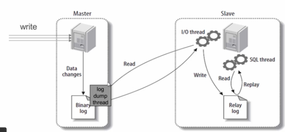
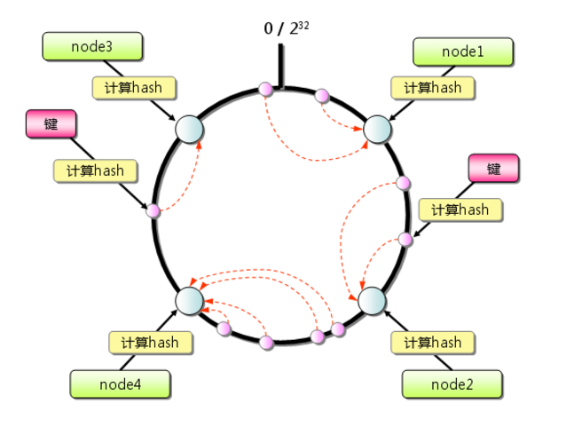
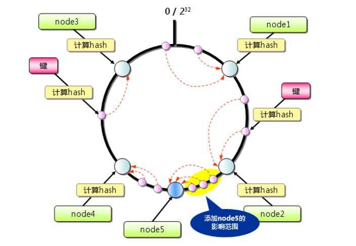

# MyCat

## Quickstart

### Mysql for Linux install

1. 下载 `mysql-5.7.23-linux-glibc2.12-x86_64.tar.gz`

2. 解压 `tar -zxvf   mysql-5.7.23-linux-glibc2.12-x86_64.tar.gz`

3. 把文件迁移 `mv mysql-5.7.23-linux-glibc2.12-x86_64 /usr/local/mysql`

4. 创建`data` 目录  `mkdir %mysql_home/data`

5. 添加用户组 `groupadd mysql  `

6. 添加`mysql`用户 且禁止 `mysql `用户登录 `shell` `useradd -r -s /sbin/nologin -g mysql mysql -d /usr/local/mysql  `

7. 递归修改 `mysql` 目录所属组和所属用户 `chown -R mysql.mysql /usr/local/mysql/ `

8. 初始化 `mysql` 数据 

   >./bin/mysql_install_db --user=mysql --basedir=/usr/local/mysql/ --datadir=/usr/local/mysql/data/
   >
   >./bin/mysqld --user=mysql --basedir=/usr/local/mysql/ --datadir=/usr/local/mysql/data/

9. 在`/etc` 目录下 寻找 `my.cnf`文件 ，如果有编辑，如果没有新增该文件

   ```ini
   [client]
   port=3306
   default-character-set=utf8
   socket=/usr/local/mysql/mysql.sock
   [mysqld]
   basedir=/usr/local/mysql
   datadir=/usr/local/mysql/data
   socket=/usr/local/mysql/mysql.sock
   character-set-server=utf8
   log-error=/usr/local/mysql/log/mysqld_error.log
   pid-file=/usr/local/mysql/mysqld.pid
   general_log=ON
   general_log_file=/usr/local/mysql/log/mysql.log
   port=3306
   sql_mode='NO_ENGINE_SUBSTITUTION'
   ```

   **且新增该文件指定文件和目录**

10. 把`mysql`放到本地系统服务中 `cp -a ./support-files/mysql.server /etc/init.d/mysqld`

11. 切换到 mysql 用户启动 `su - mysql`

    * 问题 1 `This account is currently not available.`

      > cat /etc/passwd | grep mysql
      >
      > 发现它的shell是“/sbin /nologin”，需要将起改成“/bin/bash” 
      >
      > vipw /etc/passwd 

12. `mysql`服务操作 -> `service mysqld start/stop/restart/status`

13. 服务默认配置密码 到文件  `/root/.mysql_secret`

14. 登录 `./bin/mysql -uroot -p`

15. 默认密码比较复杂 修改默认密码 `SET PASSWORD FOR 'root'@localhost=PASSWORD('12345'); `

16. 修改支持远程连接

    > use mysql
    >
    > update user set host='%' where user='root';
    >
    > flush privileges;

17. 远程连接 `mysql -h192.168.112.133 -P3306 -uroot -p`

### Mysql 组从 

* 组备配置

  1. 创建`master` 复制用户 `create user `master_user` identified by '12345';`

  2. 给新用户授权 `GRANT REPLICATION SLAVE ON *.* TO 'master'@'%' IDENTIFIED BY '12345';`

  3. 在`my.cnf` 配置

     ```ini
     server-id=101
     
     relay-log=slave-relay-bin
     
     relay-log-index=slave-relay-bin.index
     
     read_only=1
     
     replicate_do_db=db_store   数据库名
     ```

     

  4. 通过`SHOW MASTER STATUS`查看Master db状态.

     ​		

     | File                  | Position | Binlog_Do_DB | Binlog_Ignore_DB | Executed_Gtid_Set |
     | --------------------- | -------- | ------------ | ---------------- | ----------------- |
     | dbstore_binlog.000004 | 344      | db_store     |                  |                   |

     

  5. 在`slave` mysql  `my.cnf` 配置如下

     ```ini
     server-id=101
     
     relay-log=slave-relay-bin
     
     relay-log-index=slave-relay-bin.index
     
     read_only=1
     
     replicate_do_db=db_store  数据名
     
     ```

   6.  进入 `salve mysql` 

      >change master to master_host='192.168.112.132', master_port=3306,master_user='m2ssync',master_password='12345',master_log_file='dbstore_binlog.000004',master_log_pos=334;

  7. ` start salve`

  8. `show slave status;`查看slave服务器状态

  9. Mysql 基于binlog的主从复制原理

     * master 将操作的几率到二进制日志（binary log）中（这些记录叫做二进制日志事件，`binary logevents`）

     * `slave` 通过 `I/O Thread` 异步将`master` 的`binary log events` 拷贝到它的中继日志`rely log`

     * `Slave`执行`relay`日志中的事件，匹配自己的配置将需要执行的数据，在`slave`服务商执行一遍从而达到复制数据的目的。

     * 示例图

       

### Mycat for linux install

* `start error`

  >mycat JVM did not exit on request, terminated

  需要在 `wrapper.conf` 文件中追加

  ```properties
  wrapper.startup.timeout=7200
  wrapper.ping.timeout=3600
  ```

  

## Mycat 概念

### 逻辑表

* 分片表

  分片表的意思是，指定表需要分片进行分片（通过规则这条数据是存储到哪个节点），可以指定指定id进行分片规则是 `userID%2`

* 全局表

  全局表，这张表对所有数据是存储到所有节点，比方数据字典表，不大改变数据的表

* ER表

  分布表的前提下，指定数据子数据，会跟着数据父数据存储到指定节点下面

  比方 用户表和用户地址表，这个用户存储到哪个节点，这个地址需要存储到该节点下面

* 非分片表

  普通表，所有数据只到一个节点


## Mycat只配置文件

### schema.xml

### server.xml

### rule.xml

#### 分片规则

##### 连续分片

##### 离散分片

* 枚举分片

* 十进制取模

* 应用指定分片

* 字符串截取数字`hash`分片

* 一致性`hash`分片

  * 图示

    

    添加节点图示

    

##### 综合类分片


##### 分片的取舍


### wrapper.conf


## Mycat之注解

## Mycat命令行监控工具

* `show @@help;`

* `reload @@config;`

* `relod @@config_all;`
* `show @@database;`
* `show @@datanode;`
* `show @@datasource;`
* `show @@cache;`
* `show @@connection;`
* `show @@connection.sql;`
* `show @@backend;`
* `kill @@connection id1，id2;`
* `show @@heartbeat;`
* `show @@sysparam;`


 