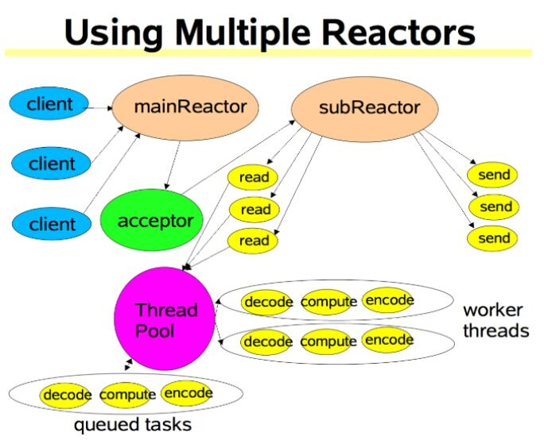

# Netty

## Netty 模型图

## 半包和粘包

* 半包： 客户端发送给服务器端的数据，很多时候不是一次性发送的，如客户端要发送一条信息“abcdef”，操作系统给服务器端可能发送了两次，先发送了ab，后发送了cdef，这种将一个完整的信息作为多次发送给服务器端的情况叫做半包。

* 粘包：客户端发送了两条信息，一条信息是“abcdef”，另一条信息是“123456”，操作系统给服务器端可能发送了一次，即abcdef123456，中两个或多条信息在一起发送的情况就是粘包

## Netty 面试题衍生

1. 默认情况下，netty服务端启多少个线程，何时启动
2. Netty是如何解决jdk空轮询的Bug
3. Netty 如何保证异步串行化
4. Netty 是如何启动的