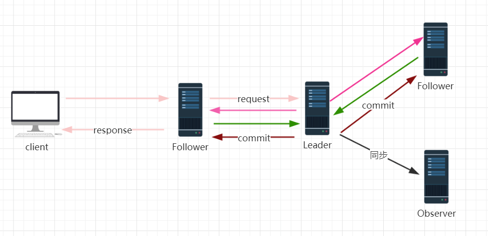

# zookeeper

[TOC]

## 课程目录[^*]

1. **从架构的发展过程说起**
2. **什么是zookeeper**
3. **zookeeper安装部署**
4. **zoo.cfg配置文件分析**
5. **zookeeper及zookeeper的设计猜想**
6. **zookeeper集群角色**
7. **深入分析ZAB协议**
8. **从源码层面分析leader选举的实现过程**
9. **关于zookeeper的数据存储**
10. **基于JavaAPI初探Zookeeper的使用**
11. **深入分析watcher机制的实现原理**
12. **Curator客户端的使用，简单高效**

## watcher 机制

## 什么是Zookeeper[^1]

### Zookeeper节点 `mode` 特性

* `PERSISTENT` - 持久化目录节点：客户端与zookeeper断开连接后，该节点依旧存在

* `PERSISTENT_SEQUENTIAL `- 持久化顺序编号目录节点：客户端与zookeeper断开连接后，该节点依旧存在，只是Zookeeper给该节点名称进行顺序编号

* `EPHEMERAL` - 临时目录节点：客户端与zookeeper断开连接后，该节点被删除

* `EPHEMERAL_SEQUENTIAL` - 临时顺序编号目录节点：客户端与zookeeper断开连接后，该节点被删除，只是Zookeeper给该节点名称进行顺序编号

### Zookeeper节点 `acl`

### Zookeeper节点 `stat` 信息

## Zookeeper安装部署[^2]

### 集群配置

* 在`zoo.cfg`文件追加 `server.1=127.0.0.1:2888:3888` 在`data`目录添加`myid`文件追加该实例`id`

  * `1`代表实例`id`

  * `2888`代表这个服务器在集群中的`leader`服务器交换信息的端口

  * `3888`万一集群中的`leader`服务器挂了，需要一个端口来重新进行选举

## Zookeeper的设计猜想[^3]

###  zookeeper 的由来

* 各个节点数据一致性

* 怎么保证任务只在一个节点上执行

* 如果某服务宕机了，其他节点如何发现并接替任务

* 存在共享资源，互斥性，安全性

### zookeeper 的前世今生

* `Google`的`Chubby`

### Zookeeper 问题衍生

1. 防止单点故障

   **如果要防止Zookeeper 这个这个中间件的单点故障，那就势 必要做集群。**

2. 集群高可用

   **每个节点都能接受到请求，而且每个节点的数据都必须保持一致，就势必需要一个`leader`节点协调和数据同步操作。所以这个集群中设计到数据同步和`leader`节点**

3. `leader` 宕机了，如何恢复

   **所以`zookeeper`用了基于`paxos`理论所衍生出来的`ZAB`协议**

4. `leader`节点如何和其他节点保证数据一致性，并且要求高一致性

   **当一个事务操作涉及到跨节点的时候，就需要用到分布式事务，分布式事务的数据一致性协议`2pc`和`3pc`协议**

*关于这些猜想，我们基本上指定zookeeper为什么要用zab 理论来做选举了、为什么要做集群，为什么要做分布式事务来实现数据一致性*

### 关于2pc提交

**（Two Phase Commitment protocol）**

## Zookeeper 集群角色

### Zookeeper 的集群 

在Zookeeper 中客户端随机连接到Zookeeper集群中的一个节点，如果是读请求就直接在当前节点中读取数据，如果是写请求，那么请求会被转发给`leader`提交事务，然后`leader`会广播事务，只要超过半数节点写入成功，那么写请求就会被提交（类2PC事务）。

所以事务请求必须有一个全局唯一的服务器来协调处理，这个服务器就是`leader`服务器，其他的服务器就是`flollower`。`leader`服务器把客户端的失去请求转化成一个事务`proposal`(提议)，并把这个`proposal`分发给集群中的所有`follower`服务器的反馈，一旦超过半数的`follower`服务器进行了正确的反馈,那么`leader`就会再次向所有的`follower`服务器发送`commit`信息，要求各个`follower`节点对前面的一个`proposal`进行提交

### 角色定义

* **leader角色**

  `leader`服务器是整个zookeeper集群的核心，主要工作任务是

  1. 事务请求的唯一调度和处理者，保证集群事务处理的顺序性

  2. 集群内部各服务器的调度者

* **follower角色**

  1. 处理客户端非事务请求，转发事务请求给`leader`服务器

  2. 参与事务请求`proposal`的投票，需要半数以上的服务器通过才能通知`leader commit` 数据；`leader`发起提案，要求`follower`投票

  3. 参与`leader`选举投票

* **Observer角色**

## 深入分析ZAB协议

**ZAB(`Zookeeper Atomic Broadcast`) 协议是为分布式协调服务，zookeeper 专门设计的一种支持奔溃恢复的原子广播协议。在zookeeper 中，主要依赖 ZAB的协议来实现分布式数据一致性，基于该协议，zookeeper 实现了一种主备模式的系统架构来保持集群中各个副本之间的数据一致性**

### ZAB协议介绍

ZAB协议包含两种基本模式

1. 奔溃恢复

2. 原子广播

**当整个集群在启动时，或者当leader节点出现网络中断，奔溃等情况时，ZAB协议就会进入恢复模式并选举产生新的leader，当leader服务器选举出来后，并集群中有过半的机器和该leader节点完成数据同步后（同步指的是数据同步，用来保证集群中过半的机器能够和leader服务器数据保持一致），ZAB协议就会推出恢复模式。当集群中已经有过半的follower节点完成了和leader状态同步以后，那么整个集群就进入了消息广播模式。这个时候，在leader节点正常工作时，启动一台新的服务器加入到集群，那这个服务器会直接进入数据恢复模式，和leader节点进入数据同步。同步完成后即可正常对外提供非事务请求的处理。**

### 消息广播实现原理

### 奔溃恢复（数据恢复）

### 关于ZXID

**ZXID,也就是事务Id**