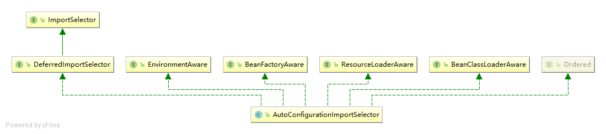

# Spring Boot

## spring-boot-autoconfigure

* `@EnableAutoConfiguration`

  * `@ConfigurationProperties` configure `@EnableConfigurationProperties`
  * SpringBoot内置条件注解
    * @ConditionalOnBean：当SpringIoc容器内存在指定Bean的条件
    * @ConditionalOnClass：当SpringIoc容器内存在指定Class的条件
    * @ConditionalOnExpression：基于SpEL表达式作为判断条件
    * @ConditionalOnJava：基于JVM版本作为判断条件
    * @ConditionalOnJndi：在JNDI存在时查找指定的位置
    * @ConditionalOnMissingBean：当SpringIoc容器内不存在指定Bean的条件
    * @ConditionalOnMissingClass：当SpringIoc容器内不存在指定Class的条件
    * @ConditionalOnNotWebApplication：当前项目不是Web项目的条件
    * @ConditionalOnProperty：指定的属性是否有指定的值
    * @ConditionalOnResource：类路径是否有指定的值
    * @ConditionalOnSingleCandidate：当指定Bean在SpringIoc容器内只有一个，或者虽然有多个但是指定首选的Bean
    * @ConditionalOnWebApplication：当前项目是Web项目的条件
       **以上注解都是元注解@Conditional演变而来的，根据不用的条件对应创建以上的具体条件注解**

* `AutoConfigurationImportSelector` 类关系图

  

## SpringBoot目录

### 组件自动装配

#### 模式注解

#### `@Enable`模块

#### 条件装配

#### 加载机制


### 外部化配置

#### `Environment`抽象

#### 生命周期

#### 破坏性变革


### 嵌入式容器

#### `ServletWeb`容器

> 

#### `ReactiveWeb`容器


### SpringBootStarter

#### 依赖管理

#### 装配条件

#### 装配顺序

### ProductionReady

#### 健康检查

#### 数据指标

#### `Endpoint`监控


## JAVA EE规范与SpringBoot

### Web

> servlet (JSR-315、JSR-340)

### SQL

> JDBC(JSR-221)

### 数据校验

> Bean Validation（JSR 303、JSR349）

### 缓存

> JAVA Cacheing ApI (JSR-107)

### WebSockets

> Java Api for websocket (JSR 356)

### WebService

> JAX-WS (JSR -224)

### Java管理

> JMX (JSR 3)

### 消息

> JMS (JSR 914)


## 课程总览

### 核心特性

#### `SpringBoot`三大特性

* 组件自动装配

  > Web MVC ,  Web Flux ，JDBC

  * 激活 `@EnableAutoConfiguration`

  * 配置 `/META-INFO/spring.factories`

    进入 `spring.factories` 在 `spring-boo-autoconfigure`模块内

    ```properties
    # Auto Configure
    org.springframework.boot.autoconfigure.EnableAutoConfiguration=\
    org.springframework.boot.autoconfigure.admin.SpringApplicationAdminJmxAutoConfiguration,\
    org.springframework.boot.autoconfigure.aop.AopAutoConfiguration,\
    org.springframework.boot.autoconfigure.amqp.RabbitAutoConfiguration,\
    org.springframework.boot.autoconfigure.batch.BatchAutoConfiguration,\
    org.springframework.boot.autoconfigure.cache.CacheAutoConfiguration,\
    org.springframework.boot.autoconfigure.cassandra.CassandraAutoConfiguration,\
    org.springframework.boot.autoconfigure.cloud.CloudAutoConfiguration,\
    org.springframework.boot.autoconfigure.context.ConfigurationPropertiesAutoConfiguration,\
    org.springframework.boot.autoconfigure.context.MessageSourceAutoConfiguration,\
    org.springframework.boot.autoconfigure.context.PropertyPlaceholderAutoConfiguration,\
    org.springframework.boot.autoconfigure.couchbase.CouchbaseAutoConfiguration
    ...
    ```

  * 实现 `XXXAutoConfiguration`

* 嵌入式Web容器

  > Tomcat , Jetty 以及 Undertow

  * `web Servlet` : `Tomcat` `Jetty`和`Undertow`
  * `WebReactive` : `Netty web Server` 
  * 

* 生成准备特性

  > 指标、健康检查、外部化配置等

  * 指标 `/actuator/metrics`
  * 健康检查 `/actuator/health`
  * 外部化配置 `/actuator/configprops`

### Web 应用

#### 传统 Servlet 应用

* Servlet 组件 ： `servlet` `filter` `Listener`
  * 实现
    * `@WebServlet`
    * `HttpServlet`
    * 注册
  * URL映射
    * `@WebServlet(url=/)`
  * 注册
    * `@ServletComponentscan("basePackages="com.*")`

* Servlet 注册 ： `Servlet` 注解 、`SpringBean` 、`RegistrationBean`

  * `@ServletComponentScan`+
    * `@WebServlet`
    * `@WebFilter`
    * `@WebListener`

* 异步非阻塞: 异步`servlet`，非阻塞`servlet`

  * 异步Servlet

    * `ServletRequest#startAsync()`

    * `AsyncContext`

      ``` java
      @WebServlet(url="/",asyncSupported=true)
      public class MyServlet extends HttpServlet {
          ...
          AsyncContext async = request.startAsync();
          async.start(()->{
              response.getWriter().println();
              async.complete（）；
                  
          });
          
      }
      ```

  * 非阻塞Servlet

    * `ServletInputStream#setReadListener`
      * `ReadListener`
    * `ServletOutputStream#setWriteListener`
      * `WriteListner`


#### SpringWebMVC应用

##### WebMVC视图

 `ViewResolver`

`View`

* 模板引擎

  * `Thymeleaf`
  * `Freemarker`
  * `JSP`

* 内容协商

  **当几种模板引擎一起使用时，就需要内容协商找到更适合的模板引擎**

  * `ContentNegotiationConfigurer`
  * `ContentNegotiationStrategy`
  * `ContentNegotiatingViewResolver`

* 异常处理

  * `@ExceptionHandler`
  * `HandlerExceptionResolver`
    * `ExceptionHandlerExceptionResolver`
  * `BasicErrorController` SpringBoot

##### WebMVC Rest

* 资源服务
* 资源跨域
  * `@CrossOrigin`
  * `WebMvcConfigure#addCorsMappings`
* 服务发现

##### WebMVC核心

* 核心架构

* 处理流程

* 核心组件

  * `DispatcherServlet`

  * `HandlerMapping`

  * `HandlerAdapter`

  * `ViewResolver`

##### SpringWebFlux应用

* Reactor基础: `Java Lambda` `Mono` `Flux`

* WebFlux 核心：`WebMVC` 注解、`函数式声明` 、`异步非阻塞`

* 使用场景

#### WebServet应用

* 切换`WebServer`

  ```xml
  <dependency>
  <groupId>org.springframework.boot</groupId>
  <artifactId>spring-boot-starter-web</artifactId>
  <exclusions>
  <!-- Exclude the Tomcat dependency -->
  <exclusion>
  <groupId>org.springframework.boot</groupId>
  <artifactId>spring-boot-starter-tomcat</artifactId>
  </exclusion>
  </exclusions>
  </dependency>
  <!-- Use Jetty instead -->
  <dependency>
  <groupId>org.springframework.boot</groupId>
  <artifactId>spring-boot-starter-jetty</artifactId>
  </dependency>
  ```

* 自定义`Servlet web Server`

  * `WebServerFactoryCustomizer`

* 自定义 `Reactive Web Server`

  * `ReactiveWebServerFactoryCustomizer`

###  数据相关

#### JDBC 

##### 依赖

```xml
<dependency>
<groupId>org.springframework.boot</groupId>
<artifactId>spring-boot-starter-jdbc</artifactId>
</dependency>
```


##### 数据源

* `javax.sql.Datasource`

* `JdbcTemplate`

##### 自动装配

* `DataSourceAutoConfiguration`

#### JPA

##### 依赖

```xml
<dependency>
<groupId>org.springframework.boot</groupId>
<artifactId>spring-boot-starter-data-jpa</artifactId>
</dependency>
```

##### 实体映射

* `@javax.persistence.OneToOne`

* `@javax.persistence.OneToMany`

* `@javax.persistence.ManyToOne`

* `@javax.persistence.ManyToMany`

##### 实体操作

* `EntityManager`

##### 自动装配

* `HibernateJpaAutoConfiguration`

#### 事务 （Transaction）

##### 依赖

##### Spring事务抽象

* `PlatformTransactionManager`

##### JDBC事务处理

* `DataSourceTransactionManager`

##### 自动装配

* `TransactionAutoConfiguration`


### 功能扩展

#### SpringBoot应用

##### SpringApplication

* 失败分析

  * `FailureAnalysisReporter`

* 应用特性

  * `SpringApplication` Fluent API

* 事件监听


##### SpringBoot配置

* 外部化配置
  * `ConfigurationProperty`
* `Profile`
* `配置属性`
  * `PropertySources`

##### SpringBootStarter

* `start`开发
* `最佳实践`

### 运维管理

#### SpringBoot Actuator

###### 依赖

```xml
<dependency>
<groupId>org.springframework.boot</groupId>
<artifactId>spring-boot-starter-actuator</artifactId>
</dependency>
```


##### 端点（Endpoints）

* `Web Endpoints`
* `JMX Endpoints`

##### 健康检查(Health Checks)

* `Health`
* `HealthIndicator`

##### 指标(Metrics)

###### 内建 Metrics

* Web Endpoint : `/actuator/metrics`
* `http://localhost:8080/actuator/metrics/jvm.memory.max`

##### 自定义 Metrics


## SpringBoot初始化过程

### 加载过程
1. 加载配置以及环境变量
2. 创建ApplicationContext
3. 准备ApplicationContext信息
4. 加载或者刷新上下文信息
5. 启动完成
6. 运行中

### 生命周期
1.开始启动 -> `starting`（`ApplicationStartingEvent`）
2.环境变量初始化完成 -> `environmentPrepared`（`ApplicationEnvironmentPreparedEvent`）
3.应用初始化完成 -> `contextLoaded`（`ApplicationPreparedEvent`）
4.应用刷新 -> `refreshContext`（`ContextRefreshedEvent`）
5.Web应用初始化完成 -> `refreshContext`（`ServletWebServerInitializedEvent`）
6.应用启动完成 -> `started`（`ApplicationStartedEvent`）
7.应用运行中 -> `running`（`ApplicationReadyEvent`）
8.应用关闭 -> `doClose`（`ContextClosedEvent`）

