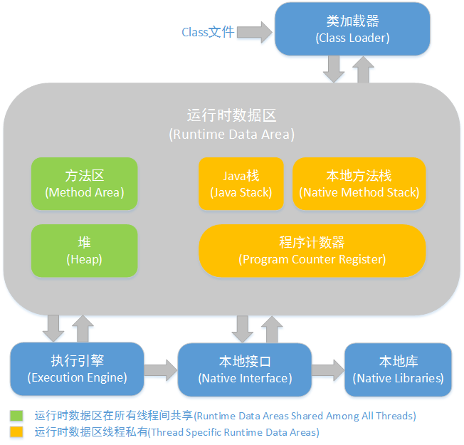
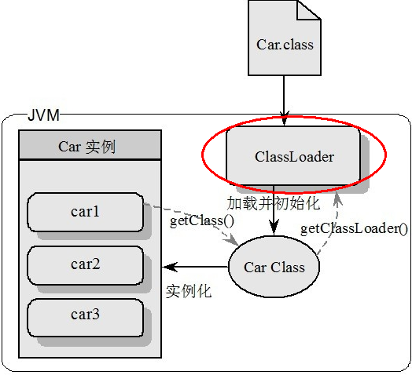
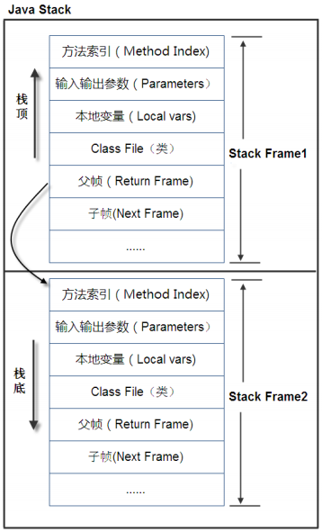

# Jvm

## Jvm 入门

### Jvm 体系结构概览

### 类装载器 `ClassLoader`

**负责加载Class文件，Class文件在文件开头有特定的文件标示，并且ClassLoader值负责class文件的加载，至于是否可用运行，则又`Execution Engine`决定**

* 图示：

  

* `ClassLoader` 依次顺序
  * 虚拟机自带的加载器
  * 启动类加载器`Bootstrap` - C++
  * 扩展类加载器 `Extension` - Java
  * 应用程序类加载器 `AppClassLoader` - Java 系统类加载器，加载当前引用的`classpath`的所有类
  * 用户自定义加载器
    * `java.lang.ClassLoader` 的子类，用户可用定制类的加载方式

### `Execution Engine`

**执行引擎负责解释命令，提交操作系统执行**

* Native Interface 本地接口

  * 本地接口的作用是融合不同的编程语言为`Java`所用

* Native Method Stack

  * 它的具体做法是`Native Method Stack`中登记`native`方法，在`Execution Engine` 执行时加载本地方法库

* PC寄存器

  * 每个线程都有一个程序计数器，时线程私有的，就是一个指针，指向方法去中的方法字节码（用来存储指向下一个指令的地址，也即将要指向的指令代码），由执行引擎读取下一条指令，是一个非常小的内存空间，几乎可以忽略不计。

* 方法区

  * `Method Area` 方法区是被所有线程共享，所有字段和方法字节码，以及一些特殊方法如构建函数，接口代码也在此定义。简单说，所有定义的方法的信息都保存在该区域，此区属于共享区间。静态变量+常量+类信息（构造方法/接口定义）+运行时常量池存在方法去

* 栈区

  * 栈也叫栈内存，主管Java程序的运行，是在线程创建时创建，它的生命期时跟随线程的生命期，线程结束栈内存也就释放，**对于栈来说不存在垃圾回收问题，只要线程一结束该栈就Over,生命周期和线程一致，是线程私有的。8种基本类型的变量+对象的引用变量+实例方法都是在函数的栈内存中分配。

  * 栈存储着什么

    * 本地变量`Local Variables`：输入参数和输出参数以及方法内的变量；
    * 栈操作`Operand Stack`: 记录出栈、入栈的操作

  * 示例图：

    

[JDK8 Docs](https://docs.oracle.com/javase/8/docs/)

[The class File Format](<https://docs.oracle.com/javase/specs/jvms/se8/html/jvms-4.html>)

[Java HotSpot VM Options](<https://www.oracle.com/technetwork/java/javase/tech/vmoptions-jsp-140102.html#Options>)

## Jvm 实操

### JDK 命令信息

* `jps`
* `jmap -heap PID` 查看堆内存情况
* `jinfo -flags PID` 打印JVM配置的参数信息
* `jmap -histo  PID` 打印该实例加载了哪些类
* `jmap -dump:format=b,file=dump.log PID`  生成`dump`二进制文件  通过` jhat dump.log` 生成web默认`7000`端口可查看具体信息

### JDK自带监控工具

## 附件问题

1. Asm / Asm3.0实现
   * `Javassist`
   * `cglib`

2.  OpenJDK [官网](<http://openjdk.java.net/projects/jdk/>)
   * 下载路径 [JDK11](<http://jdk.java.net/11/>) [JDK12](<http://jdk.java.net/12/>)

## 常用调优参数

- \- : 标准VM选项，VM规范的选项
- -X: 非标准VM选项，不保证所有VM支持
- -XX: 高级选项，高级特性，但属于不稳定的选项

### 内存分配

* `-Xmx1024M` 最大堆内存`1024M` 等同于`-XX:MaxHeapSize`
* `-Xms1024M` 初始化堆内存 `1024M `  ，`ms`就是`memory size` 缩写
* `-Xmn1024` 堆中新生代初始及最大大小，如果需要进一步细化，初始化大小用`-XX:NewSize`，最大大小用`-XX:MaxNewSize`
* `-Xss256K` 线程栈大小，等同于`-XX:ThreadStackSize`   `ss`就是`stack size` 的缩写
* `-XX:NewRatio=5` 新生代老年代比例 `new:old=1:5`
* `-XX:SurvivorRatio=8`  `eden:from:to=8:1:1`

### 内存调试

* `-XX:+PrintGCDetails` 打印GC日志详情和堆内存情况
* `-verbose:gc` 执行GC时打印GC日志