[TOC]

# Mysql 优化

**优化点 可以从业务这块来优化，然后就是并发，并发的话数据库连接数，数据库锁，在需求可以的情况下尽量使用隔离级别小的。然后就是数据库层面的缓存，配置缓存大小。然后就是`sql`优化主要点还是在索引 `join_buffer_size`，`sort_buffer_size`减少拷贝空间换时间**


## 初识Mysql体系结构

### 存储引擎

## 理解Mysql底层B+tree索引机制

[索引演示](https://www.cs.usfca.edu/~galles/visualization/Algorithms.html)

### 索引是什么

**索引是为了加速对表中数据行的检索而创建的一种分散存储数据结构**

### 为什么要使用索引

* 索引能极大的减少存储引擎需要扫描的数据量
* 索引可以把随机IO变成顺序IO
* 索引可以帮助我们在进行分组、排序等操作时，避免使用临时表

## 为什么是B+Tree

### 二叉查找树Binary Search Tree

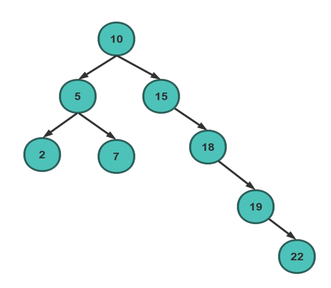

### 平衡二叉查找树

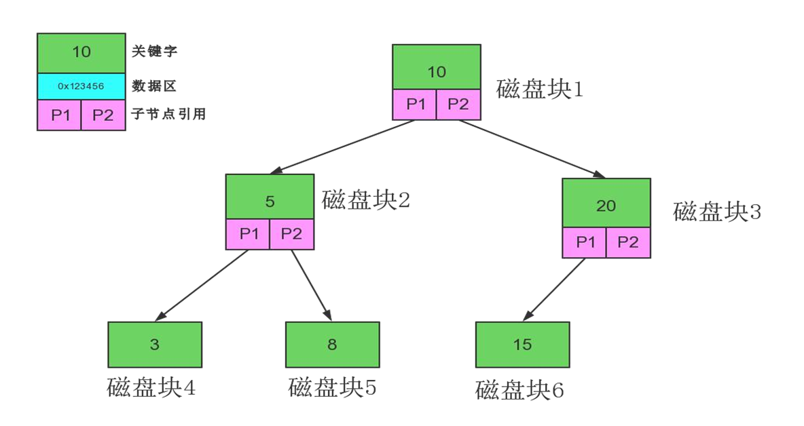

### 使用二叉树弊端

* 它太深了
  * 数据处的（高）深度决定着他的IO操作次数，IO操作耗时大
* 它太小了
  * 每一个磁盘块（节点/页）保存的数据量太小了
  * 没有很好的利用操作磁盘`IO`的数据交换特效，页没有利用好磁盘`IO`的预读能力（空间局部性原理），从而带来频繁的`IO`操作


### 多路平衡查找树 ，B-Tree

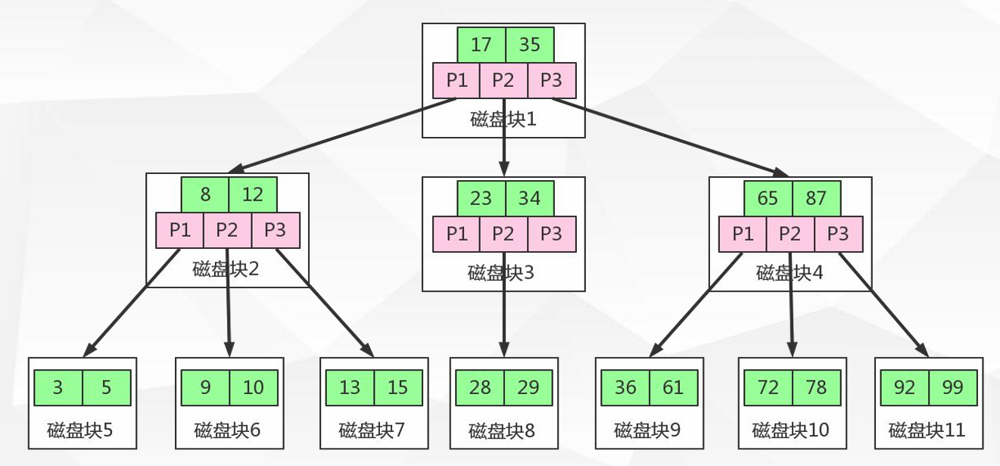


### 加强版多路平衡查找树 B+树

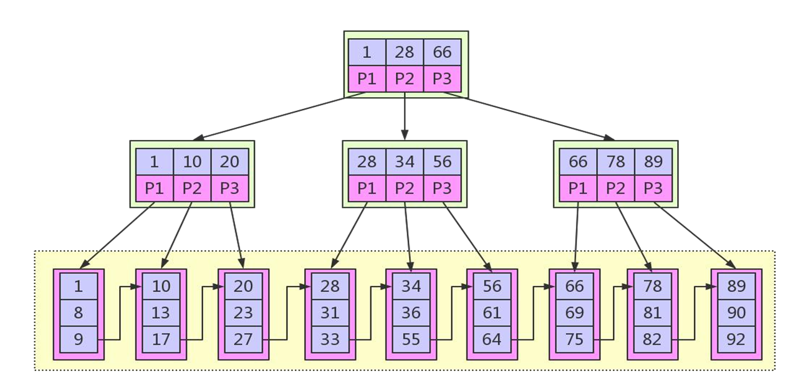

### B+Tree 与B-Tree的区别

* B+节点关键字搜索采用闭合区间
* B+非叶节点不保存数据相关信息，只保存关键字和子节点的引用
* B+关键字对应的数据保存在叶子节点中
* B+叶子节点是顺序排列的，并且相邻节点具有顺序引用的关系

### 为什么选B+Tree 

* B+树是B-树的变种（PLUS版）多路绝对平衡查找树，他拥有B-树的优势
* B+树扫库、表能力更强
* B+树的磁盘读写能力更强
* B+树的排序能力更强
* B+树的查询效率更加稳定
  * 由于都需要找到末尾页子节点才能找到数据

## Mysql B+Treee 索引体系形式

### 索引-Myisam

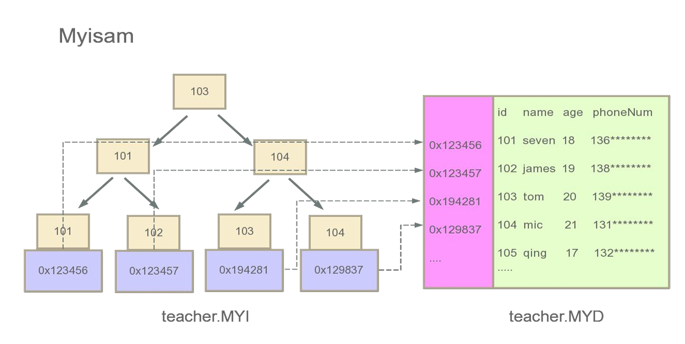

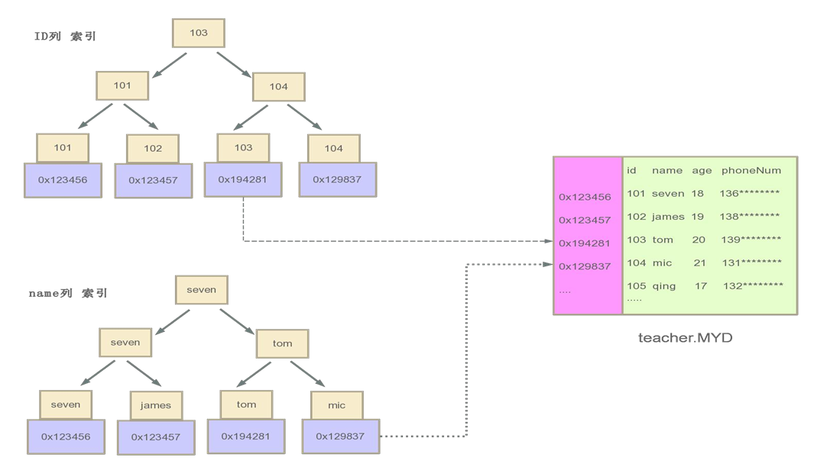

### 索引-Innodb

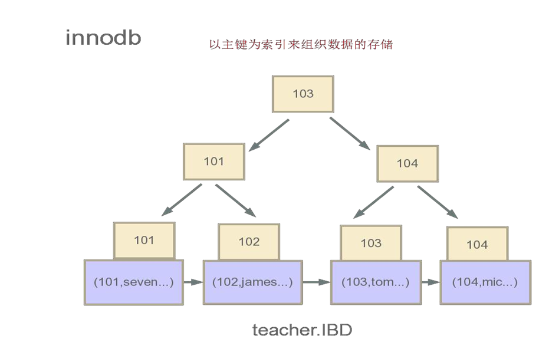

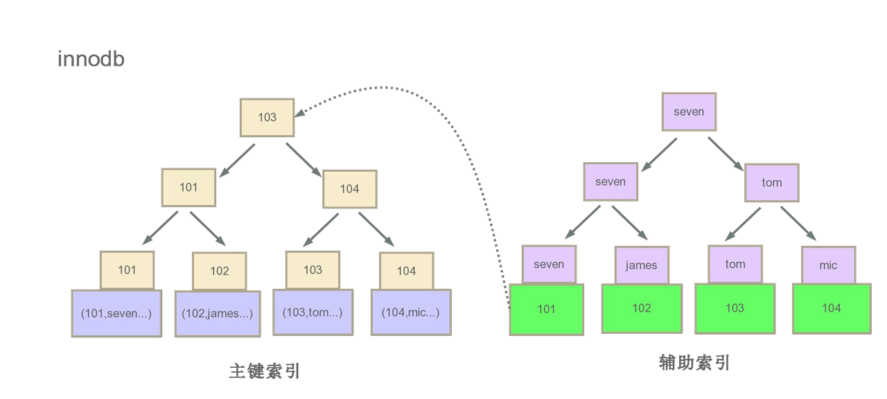

* 聚集索引
  * 数据库表行中数据的物理顺序与键值的逻辑（索引） 顺序相同


### Innodb VS Myisam

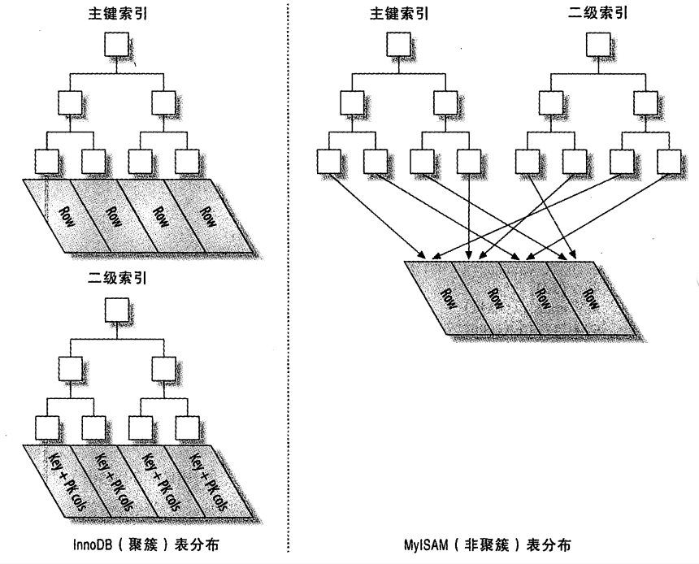


## 索引知识补充

### 列的离散性

* `count(distinct col) : count(col)`
* 越大离散性越好
* 离散性越高选择性就越好

### 最左匹配原则

* 对索引中关键字进行计算，一定是从左往右依次进行，且不可跳过

### 覆盖索引

* 如果查询列可通过索引节点中的关键字直接返回，则该索引称之为覆盖索引。覆盖索引可减少数据库`IO`，将随机`IO`变为顺序`IO`，可提高查询性能

## Mysql 插拔式的存储引擎


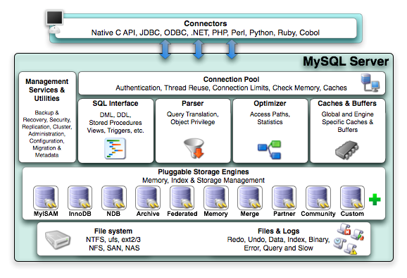


### 存储引擎介绍

* 插拔式的插件方式
* 存储引擎是制定在表之上的，即一个库中的每一个表都可以制定专用的存储引擎
* 不管表采用什么样的方式的存储引擎，都会在数据区，产生对应的`frm`文件（表结构定义描述文件）

### CSV存储引擎

* 数据存储以`CSV`文件

* 特点

  * 不能定义没有索引、列定义必须为`NOT NULL` 、不能设置自增列
  * 不适合大表或者数据的在线处理

  * `CSV` 数据存储用`,`隔开，可直接编辑`CSV`文件进行数据的编排

  * 数据安全性低

    **编辑之后，要生效使用`flush tables XXX` 命令**

* 应用场景

  * 数据的快速导入导出
  * 表直接转换成CSV

### Archive存储引擎

* 压缩协议进行数据存储
* 数据存储为`ARZ`文件格式
* 特点
  * 只支持`insert`和`select`两种操作
  * 只允许自增`ID`列建立索引
  * 行级锁
  * 不支持事物
  * 数据占用磁盘少
* 应用场景
  * 日志系统
  * 大量的设备数据采集

### Memory存储引擎

* 数据都是存储在内存中，IO效率要比其他引擎高很多，服务重启数据丢失，内存数据表默认只有16M
* 特点
  * 只支持`hash`索引，`B Tree`索引，默认`hash`（查找复杂度O(1)）
  * 字段长度都是固定长度varchar(32)=char(32)
  * 不支持大数据存储类型字段如：`blog`，`text`
  * 表级锁
* 应用场景
  * 等值查找热度较高的数据
  * 查询结果内存中的计算，大多数都是采用这种存储引擎作为临时表存储需计算的数据

### Myisam存储引擎

* `Mysql5.5`版本之前的默认存储引擎

* 较多的系统表也还是使用这个存储引擎

* 系统临时表也会用到`Myisam`存储引擎

* 特点

  * `select count(*) from table`无需进行数据的扫描
  * 数据`MYD`和索引`MYI`进行分开存储
  * 表级锁
  * 不支持事务

  

### Innodb存储引擎

* `Mysql5.5`及以后版本的默认存储引擎
* 特点
  * 事务`ACID`
  * 行级锁
  * `聚集索引(主键索引)方式进行数据存储`
  * 支持外键关系保证数据完整性

## Mysql体系结构及运行机理

### Mysql体系结构

* `Client Connectors` 接入方支持协议很多
* `Management Services & Utilities`
  * 系统管理和控制工具`mysqldump`，`mysql`复制集群、分区管理等
* `Connection Poll`
  * 连接池：管理缓冲用户连接、用户名、密码、权限校验、线程处理等需要缓存的需求
* `SQL Interface`
  * `sql`接口：接受用户的`SQL`命令，并且返回用户需要查询的结果
* `Parser`
  * 解析器，SQL命令传递到解析器的时候会被解析器验证和解析。解析器是由`Lex`和`YACC`实现的
* `Optimizer`
  * 查询优化器，`SQL`语句在查询之前会使用查询优化器对查询进行优化
* `Cache`和`Buffer`高速缓存区
  * 查询缓存，如果查询缓存有命中的查询结果，查询语句就可以直接去查询缓存中取数据
* `pluggable storage Engines`
  * 插件式存储引擎。存储引擎是`Mysql` 中具体与文件打交道的子系统
* `file system`
  * 文件系统，数据，日志（`redo`,`undo`），索引，错误日志、查询记录，慢查询等


## Mysql查询优化详解

### Mysql 查询优化-查询执行的路径

1. `mysql` 客户端/服务端通信
2. 查询缓存
3. 查询优化处理
4. 查询执行引擎
5. 返回客户端

### Mysql客户端/服务端通信

* `mysql`客户端与服务端的通信方式是`半双工`
  * 全双工：双向通信，发送同时也可以接收
  * 半双工：双向通信，同时只能接收或者发送，无法同时做操作
  * 单工：只能单一方向传送
* 半双工通信
  * 在任何一个时刻，要么是由服务端向客户端发送数据，要么是客户端向服务端发送数据，这两个动作不能同时发生。所以我们无法也无需将一个小小切成小块进行传输
* 特点和限制
  * 客户端一旦开始发送消息，另一端要接收完整个消息才能响应。
  * 客户端一旦开始接收数据没法停下来发送指令。

### mysql 客户端/服务端通信-查询状态

* `profiles`
  * `set profiling = 1` 
  * `select * from t_user_innodb limit 1`
  * `show profiles`
  * `show profile cpu,block io for query 17`  `17=show profiles QueryId`

* `show status like 'table%'` 表级锁的争用状态变量
* `show status like 'innodb_row_lock%' ` 行级锁争用状态变量

* `show variables like'max_connections'` 查看当前最大连接数

  * `set global max_connections=1000` 设置最大的连接数

* `show processlist`

* `show full processlist`

* `show status like '%Uptime'` 

  >a. show tables或show tables from 'database_name'; -- 显示当前数据库中所有表的名称。
  >b. show databases; -- 显示mysql中所有数据库的名称。
  >c. show columns from table_name from 'database_name'; 或show columns from database_name.table_name; -- 显示表中列名称。
  >d. show grants for user_name; -- 显示一个用户的权限，显示结果类似于grant 命令。
  >e. show index from table_name; -- 显示表的索引。
  >f. show status; -- 显示一些系统特定资源的信息，例如，正在运行的线程数量。
  >g. show variables; -- 显示系统变量的名称和值。
  >h. show processlist; -- 显示系统中正在运行的所有进程，也就是当前正在执行的查询。大多数用户可以查看他们自己的进程，但是如果他们拥有process权限，就可以查看所有人的进程，包括密码。
  >i. show table status; -- 显示当前使用或者指定的database中的每个表的信息。信息包括表类型和表的最新更新时间。
  >j. show privileges; -- 显示服务器所支持的不同权限。
  >k. show create database database_name; -- 显示create database 语句是否能够创建指定的数据库。
  >l. show create table table_name; -- 显示create database 语句是否能够创建指定的数据库。
  >m. show engies; -- 显示安装以后可用的存储引擎和默认引擎。
  >p. show warnings; -- 显示最后一个执行的语句所产生的错误、警告和通知。
  >q. show errors; -- 只显示最后一个执行语句所产生的错误。

### 查询缓存

* `show variables like 'query_cache%'` 查看缓存开启情况

  * `quer_cache_type`  
    * `0` 关闭
    * `1` 开启
    * `2` 按需开启

* `show status like 'Qcache%'` 缓存情况 

  * `Qcache_hits` 缓存命中次数
  * `Qcache_inserts` 缓存插入条数

  **`select sql_no_cache * from users where id = 33`** 表示不走缓存

## 执行计划

`EXPLAIN`

### 执行计划字段说明

* `table`

  执行的是哪一张表 或者是别名

* `type` 

  访问类型，`sql` 查询好坏的一个重要指标，结果值从好到坏依次

  * `system` : 表只有一行记录
  * `const` : 表示通过索引一次就找到了，`const` 用于比较`primary key` 或者 `unique` 索引
  * `eq_ref` ：唯一索引扫描，对于每个索引，表中只有一条记录与之匹配。常见于主键或唯一索引扫描
  * `ref` : 非唯一性索引扫描，返回匹配某个单独值的所有行，本质是也是一种索引访问
  * `range`：只检索给定范围的行，使用一个索引来选择行
  * `index`：Full Index Scan，索引全表扫描，把索引从头到尾扫一遍
  * `ALL`：Full Table Scan，遍历全表以找到匹配的行 

* `possible_keys`

  查询过程中有可能用到的索引

* `key`

  实际使用的索引，如果为`null` 则没有使用索引

* `rows`

  根据表统计信息或者索引选用情况，大致估算出找到所需的记录所需要读取的行
  数

* `filtered`

  它指返回结果的行占需要读到的行(rows列的值)的百分比表示返回结果的行数占需读取行数的百分比，filtered的值越大越好

* `extra`

  重要的额外信息

  * `Using filesort` ：mysql对数据使用一个外部的文件内容进行了排序，而不是按照表内的索引进行排序读取
  * `Using temporary`：使用临时表保存中间结果，也就是说mysql在对查询结果排序时使用了临时表，常见于order by 或 group by
  * `Using index`：表示相应的select操作中使用了覆盖索引（Covering Index），避免了访问表的数据行，效率高
  * `Using where` ：使用了where过滤条件
  * `select tables optimized away`：基于索引优化MIN/MAX操作或者`MyISAM`存储引擎优化COUNT(*)操作，不必等到执行阶段在进行计算，查询执行计划生成的阶段即可完成优化


## 事务

**数据库操作的最小工作单元，是作为单个逻辑工作单元执行的一系列操作；
事务是一组不可再分割的操作集合（工作逻辑单元）**

* `Mysql` 如何开启事务

  * 手动开启事务

    ```sql
    begin/start transaction
    ```

  * 事务提交或者回滚

    ```sql
    commit / rollback
    ```

  * 事务是否自动开启

    ```sql
    set session autocommit = on/of
    ```

  * 查询事务是否自动开启`SELECT @@autocommit;`

  * 示例

    ```sql
    set session autocommit = OFF;   -- 第一步
    SELECT @@autocommit;   -- 第二步
    start transaction -- 第三步
    UPDATE t_article SET `status` = 3 WHERE id = 1  -- 第四部
    COMMIT  -- 第五步
    ```

* 事务隔离级别

  * 查看当前会话隔离级别

    ```sql
    select @@tx_isolation;
    ```

  * 查看系统当前隔离级别

    ```sql
    select @@global.tx_isolation;
    ```

  * 设置当前会话隔离级别

    ```sql
    set session transaction ISOLATION level repeatable read;
    ```

  * 设置系统当前隔离级别

    ```sql
    set global transaction isolation level repeatable read;
    ```

  * 命令行，开始事务时

    ```sql
    set autocommit=off 或者 start transaction
    ```

  * 隔离级别

    * `read uncommitted` (脏读)

      假设两个事务  a 事务查询到 b 事务没有提交的数据，b事务有可能提交或回滚，如果回滚了a 读到的数据就是脏数据

    * `read committed`（不可重复读，幻读）

      假设两个事务  a 事务读取一条数据，b 事务修改了这条数据且提交了，a再去读这条数据的时候 两次读出来的不一样

    * `repeatable read` 

    * `serializable`

      串行化，可读，不可写

### 事务ACID 特性

* 原子性（`atomicity`）

  最小的工作单位，整个工作单元要么一起提交，要么全部失败回滚

* 一致性 （`Consistency`）

  事务中操作的数据及状态改变是一致的，即写入资料的结果必须完全符合预设的规则，不会因为出现系统的意外等原因导致状态的不一致

  **原子性和一致性的区别在于，比如转账，A转账给B 100元。A扣除成功和B收入成功 ，或者是A扣除失败和B收入失败，这叫原子性。A扣除100元，B收入100元，这叫一致性**

* 隔离型（`Isolation`）

  一个事务所操作的数据在提交之前，对其他事务的可见性设定

* 持久化`Durability`

  事务所做的修改就会永远保存，不会因为意外导致数据的丢失


### 事务带来哪些并发问题

* 脏读（`read_uncommitted`）

  当一个事务可以读取到，其他事务没有提交的数据

* 不可重复读（`read_committed`）

  两个事务  a 事务读取一条数据，b 事务修改了这条数据且提交了，a再去读这条数据的时候 两次读出来的不一样

* 幻读/可重复读（`repeatable read`）

  假设两个事务 a 事务读取一条数据，b 事务对该条数据进行了删除且提交了，a再去读这条数据的时候 还能读出来

### 事务四种隔离级别

* `Read Uncommitted` 未提交读    -- 未解决并发问题

  * 事务未提交对其他事务也是可见的，脏读`dirty read`

* `Read Committed` 提交读   -- 解决脏读问题
  * 一个事务开始之后，只能看到自己提交的事务所做的修改，不可重复读`nonrepeatable read`
* `Repeatable Read` 可重复读  -- 解决不可重复读问题
  * 在同一个事务中多次读取同样的数据结果是一样的，这种隔离级别未定义解决幻读的问题
* `Serializable` 串行化
  *  最高的隔离级别，通过强制事务执行


### Innodb 引擎对隔离级别的支持程度

| 事务隔离级别 | 脏读   | 不可重复读 | 幻读   |
| ------------ | ------ | ---------- | ------ |
| 未提交读     | 可能   | 可能       | 可能   |
| 提交读       | 不可能 | 可能       | 可能   |
| 可重复读     | 不可能 | 不可能     | 不可能 |
| 串行化       | 不可能 | 不可能     | 不可能 |

  

### 获取当前事务隔离级别

1. 查看当前会话隔离级别

   `select @@tx_isolation;`

2. 查看系统当前隔离级别

   `select @@global.tx_isolation;`

3. 设置当前会话隔离级别

   `set session transaction ISOLATION level repeatable read;`

4. 设置系统当前隔离级别

   `set global transaction ISOLATION level repeatable read;`

## 锁

### 理解表锁、行锁

* 锁是用于管理事务对共享资源的并发访问
* 表锁与行锁的区别
  * 锁定颗粒度 ： 表锁 > 行锁
  * 加锁效率： 表锁 > 行锁
  * 冲突概率 ： 表锁 > 行锁
  * 并发性能 : 表锁 < 行锁
* `InnoDB` 存储引擎支持行锁和表锁

### 共享锁(行锁) ：`shared locks`

又称读锁，简称`S`锁，只能读不能修改，共享锁就是多个事务对于同一个数据可以共享一把锁，都能访问到数据，但是只能读不能修改

>begin
>
>SELECT * FROM inquiry WHERE linkman = '小雪' LOCK in SHARE MODE;
>
>commit/rollback

后面条件匹配的所有数据都会上锁，只能查不能改，需要等待该事务完成

### 排他锁(行锁)：`Exclusive locks`

又称为写锁，简称`X`锁，排他锁不能与其他锁并存，如一个事务获取了一个数据行的排他锁，其他事务就不能再获取该行的锁（共享锁，排他锁）,只有该获取了排他锁的事务是可以对数据行进行读取和修改，（其他事务要读取数据可来自于**快照**）

>BEGIN
>
>SELECT * FROM user_info WHERE username='钱十' for UPDATE;
>
>ROLLBACK
>
>-------------------------------------------------------
>
>SELECT * from user_info WHERE username = '钱九' for  UPDATE;
>
>
>SELECT * from user_info WHERE username = '钱十' lock in share mode;
>
>
>SELECT * from user_info WHERE username = '钱九'

在`username` 没有索引的时候，锁的是全部行，添加索引只锁匹配数据行

### 行锁到底锁了什么

* InnoDB的行锁是通过给索引上的索引项加锁来实现的

* 只有通过索引条件进行数据检索，`Innodb` 才会使用行级锁，否则`Innodb` 将使用表锁（锁住索引的所有记录），除了数字区间外

* 手动上表锁

  `lock tables 表名 read/write`
  
* 手动解锁

  `unlock tables`

### 意向锁共享锁（表锁）： Intention Shared Locks

* 表示事务准备给数据行加入共享锁，即一个数据行加共享锁钱必须先取得IS锁，意向共享锁之间是可以相互兼容的

### 意向锁排它锁（表锁）：Intention Exclusive Locks

* 表示事务准备给数据行加入排他锁，即一个数据行加排他锁前必须先取得该表的IX锁，意向排它锁之间是可以相互兼容的

**意向锁（`IX`,`IS`）是`Innodb`数据操作之前自动加的，不需要用户干预**

**意义**

* 当事务想去进行锁表时，可以先判断意向锁是否存在，存在时则可快速返回该表不能启用表锁

* ```sql
  ----- IS锁的意义
  set session autocommit = OFF;
  update users set lastUpdate=NOW() where id = 1;
  rollback;
  
  -- 其他会话执行
  update users set lastUpdate=NOW() where phoneNum = '13777777777';
  ```


### 自增锁Auto-InC Locks

* 针对自增锁的一个特殊的表级别锁
* `show variables like 'innodb_autoinc_lock_mode'`
* 默认取值`1`,代表连续，事务未提交`ID`永久丢失


### 记录锁(Record)

**锁住具体的索引项**

* 当`SQL`执行按照唯一性`primary key`,`Unique key`索引进行数据的检索时，查询条件等值匹配且查询的数据存在，这是`SQL`语句加上的锁即为记录锁`record Locks`,锁住具体的索引项

* 图示

  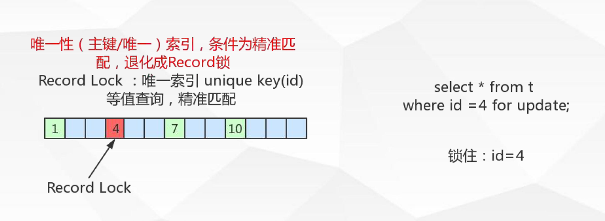

### 间隙锁(Gap)

**锁住数据不存在的区间左开右开**

* 当`sql`执行按照索引进行数据的检索时，查询条件的数据不存在，这是`SQL`语句加上的锁即为`Gap locks`,锁住索引不存在的区间(左开右开)

* 图示

  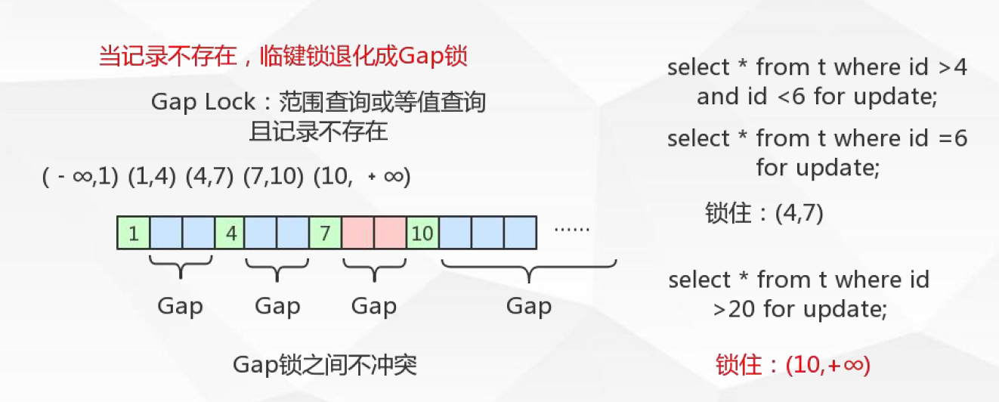

* `Gap`只在`RR`事务级别存在

### 临键锁(Next-KEY)

**锁住记录+区间**

* 当`SQL` 执行按照索引进行数据的检索时，查询条件为范围查询(`between and` ，`<`，`>`等)并有数据命中则此时`SQL`语句加上的锁`Next-KEY locks`，锁住索引的记录+区间（左开右闭）

* 图示

  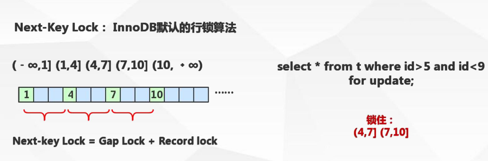

* 为什么`Innodb`选择临键锁`Next-key`作为行锁的默认算法

  解决幻读


### 利用锁怎么解决脏读

* 加上`X`锁（排他锁）

### 利用锁怎么解决不可重复读

* 加上`S`锁（共享锁）

### 利用锁怎么解决幻读

* 加上`Next-key` (临键锁)

### 死锁的介绍

* 多个并发事务(2个或两个以上)
* 每个事务都持有锁（或者是已经在等待锁）
* 每个事务都需要在继续持有锁
* 事务之间产生加锁的循环等待，形成死锁

### 死锁的避免

1. 类似的业务逻辑以固定的顺序访问表和行
2. 大事务拆小。大事务更倾向于死锁，如果业务运行，将大事务拆小。
3. 在同一个事务中，尽可能做到一次锁定所需要的所有资源，减少死锁概率
4. 减低隔离级别，如果事务允许，将隔离级别调低也是较好的选择
5. 为表添加合理的索引。可以看到如果不走索引将会为表的每一行记录添加上锁（或者说是表锁）


### MVCC 

**Multiversion concurrency controll ** 多版本并发控制

并发访问（读或写）数据库时，对正在事务内处理的数据做多版本的管理。以达到用来避免写操作的阻塞，从而引发读操作的并发问题


### Mysql 中MVCC逻辑流程-插入

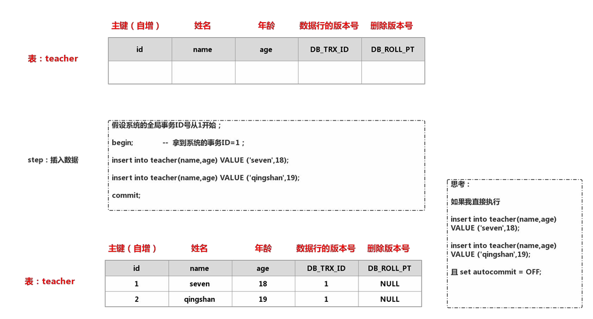

### Mysql 中MVCC逻辑流程-删除

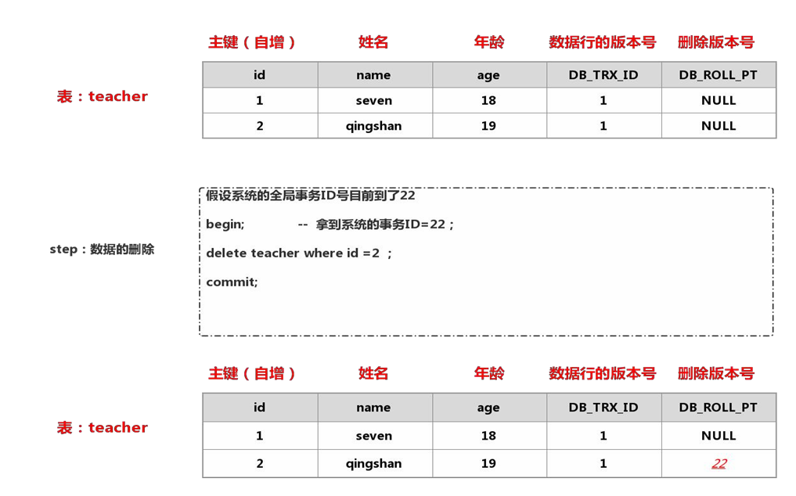

### Mysql 中MVCC逻辑流程-修改

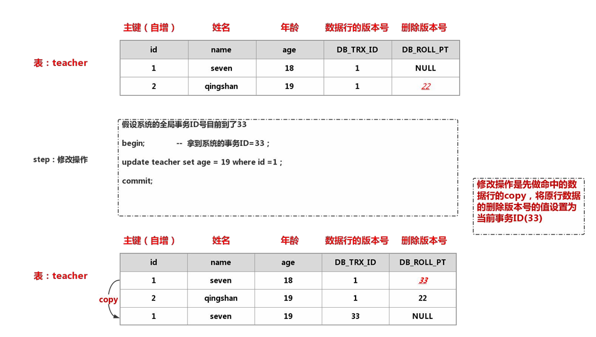

### Mysql 中MVCC逻辑流程-查询


## 日志模块

### Undo log

**`undo`意为取消，以撤销操作为目的，返回指定某个状态的操作**

**`undo log`指事务开始之前，在操作任何数据之前，首先将需操作的数据备份到一个地方`Undo Log`**

* `UndoLog `是为实现事务的原子性而出现的产物

* `Undo log`实现原子性
  
  * 事务处理过程中如果出现了错误或者用户执行了`Rollback`语句，`Mysql`可以利用`Undo Log`中的备份将数据恢复到事务开始之前的状态
  
* `UndoLog`在`Mysql innodb`存储引擎中用来实现多版本并发控制

* `Undo Log`实现多版本并发控制

  * 实现未提交之前，`Undo`保存了未提交之前的版本数据，`Undo`中的数据可为数据旧版本快照供其他并发事务进行快照读

* 图示

  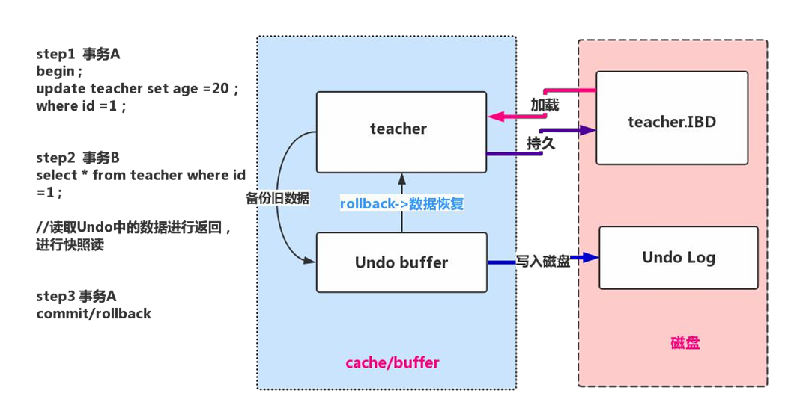

* 当前读、快照读

  * 当前读：

    `SQL` 读取的数据是快照本，也就是历史版本，普通的`SELECT`就是快照读

    `innodb`快照读，数据的读取将由`cache`(原本数据)+`undo`(事务修改过的数据)两部分组成

  * 当前读：

    `SQL`读取的数据是最新版本。通过锁机制来保证读取的数据无法通过其他事务进行修改

    `update,delete,insert,select .. lockinshare mode,select ..fro update` 都是当前读

### Redo log

**`redo`，顾名思义就是重做。以恢复操作为目的，重现操作**

* `redo log`指事务中操作的任何数据，将最新的数据备份到一个`redo log`

* `redo log`的持久：

  * 不是随着事务的提交才写入的，而是在事务的执行过程中，便开始写入`redo`中。具体的落盘策略可以进行配置

* `redo log`是为了实现事务的持久性而出现的产物

* `redo log`实现事务持久性：

  * 防止在发生故障的时间点，尚有脏也未写入磁盘，在重启`mysql`服务的时候，根据`redo log`进行重做，从而达到事务的未入磁盘数据进行持久化这一特性。

* 图示

  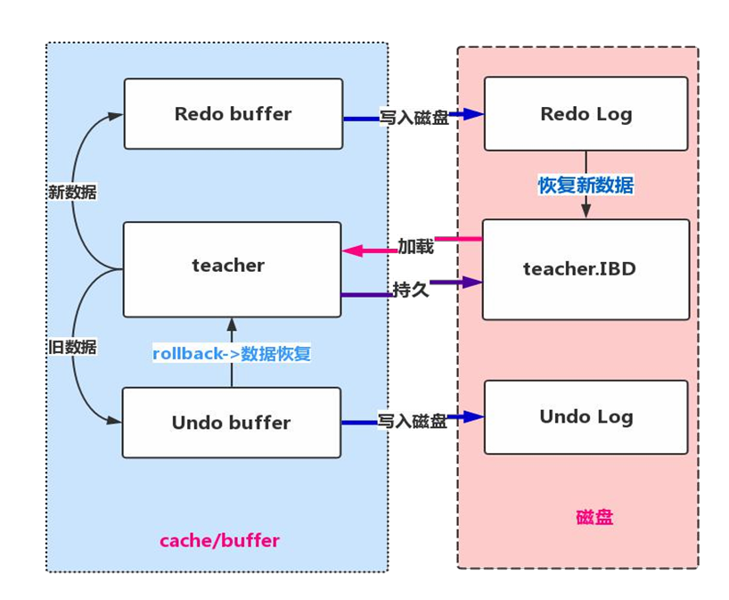

* 制定`redo log`记录在`{datadir}/ib_logfile1&ib_logfile2` 可通过`innodb_log_group_home_dir`配置制定目录存储
* 一旦事务成功提交且数据持久化落盘之后，此时`redo log`中的对应事务数据记录就失去了意义，所以`redo log`的写入日志文件循环写入的
  * 指定`redo log`日志文件组中的数据`innodb_log_file_in_group `默认是`2`
  * 指定`redo log`每一个日志文件最大存储量`innodb_log_file_size`默认是`48M`
  * 指定`redo log`在`cache/buffer`中的`buffer`池大小`innodb_log_buffer_size` 默认`16M`
* `redo buffer `持久化`redo log`的策略，`innodb_flush_log_at_trx_commit`:
  * 取值`0`每秒提交`redo buffer --> redo log OS cache --> flush cache to disk` 可能丢失一秒内事务数据
  * 取值`1`默认值，每次事务提交执行`redo buffer --> redo log OS cache --> flush cache to disk`最安全，性能最差的方式
  * 取值`2`每次事务提交执行`redo buffer --> redo log os cache`再每一秒执行 `-> flush cache to disk`操作

### Bin log


## 配置优化

### Mysql 服务器参数类型


### 事物和锁Mysql存储的关系

**到`information_schema`库中查一下表**

* `innodb_trx` 当前运行的所有事务
* `innodb_locks` 当前出现的锁
* `innodb_lock_waits` 锁等待的对饮关系


