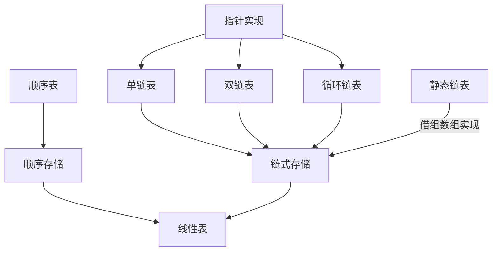

# 链表

* 线性链表示一种逻辑结构，**相同数据类型**的`n`个数据元素的有序序列，出第一个元素外，每个元素**有且仅有**一个直接前驱，除最后一个元素外，每个元素**有且仅有一个**直接后继

  *线性表具有以下特点*

  * 元素个数有限
  * 逻辑上元素有先后次序
  * 数据类型相同
  * 仅讨论元素间的逻辑关系

## 数组和链表的区别

* 数组的有点

  * 随机访问性强

  * 查询速度快

* 数组的缺点
  * 插入和删除效率低
  * 可能浪费内存
  * 内存空间要求高，必须有足够的连续内存空间
  * 数组大小固定，不能动态扩展

* 链表的有点

  * 插入删除速度快

  * 内存利用率高，不会浪费内存

  * 大小没有固定，扩展很灵活

* 链表的缺点

  * 不能随机查询，必须从第一个开始遍历，查询效率低

| 操作 | 数组 | 链表 |
| ---- | ---- | ---- |
| 读取 | O(1) | O(n) |
| 插入 | O(n) | O(1) |
| 删除 | O(n) | O(1) |

## 单链表,双链表，循环链表

* 循环单链表
  * 与单链表的区别在于，表中最后一个节点的指针不为`null`，而改为指向头节点（第一个节点），从而整个链表形成一个环。判断循环单链表是否为空，判断是否等于头指针。只有一个尾指针的循环单链表，可以很方便的操作表头和表尾，因为为指针的后继就是头指针O（1）.
* 循环双链表
  * 与双链表的区别在于，头节点的`prior`指针指向尾节点，尾节点的`next`指针指向头节点。

**在单向链表中在删除链表中元素时，如果被删除链表的`next`不为空的情况下，最快删除方法是，把`next`节点的数据赋值给，当前要被删除的节点，然后把单前被删除的节点的，`next`指向要被删除节点的`next`的`next`节点，然后把要被删除的节点的`next`节点的`next`设置为`null`,也就快速删除了**

